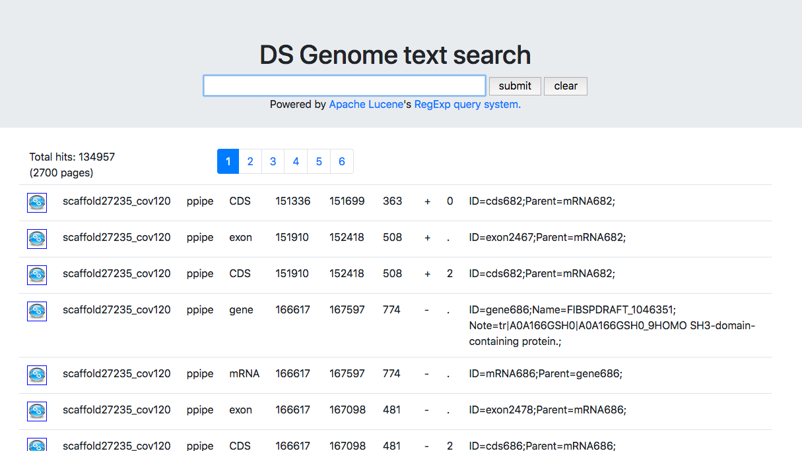

# DS-text-search (ver. 2)

GFFファイルの検索とJBrowseとの連携
Apache LuceneのRegexpQueryを使った正規表現による全文検索

## 概要

Apache Luceneは全文検索のためのJavaのライブラリであり、
ElasticSearchやApache Solrといった有名なオープンソースの全文検索システムは
内部でApache Luceneを使っている。

Luceneの普通の使い方はStandardAnalyzerなどで字句解析して転置インデックスを作ることであるが、
この方法だと後方一致ができない。(例えば正規表現なら`.?RNA`とやればmRNA, rRNA, ...を探せるがこれができない。)
このためLuceneのRegexQueryを用いて正規表現による全文検索とした。

単純にJavaの正規表現ルーチンを使った場合はWebアプリの処理速度として実用にならなかったが、
本バージョンでは13万行程度のgffファイルでも十分高速に動作する。

## 更新履歴

- version 2.0.1
    - リバースプロキシ環境で動作させるためのURLの調整
- version 2.0.0
    - 基本的な機能を実装
        - Luceneによる全文検索
        - Bootstrap4のtable, pagenationウィジェットを利用
        
## インストール方法

### 前提

- Java version 10
- Apache maven version 3
- git 

### コンパイル方法

	git clone http://gitlab.ddbj.nig.ac.jp/oogasawa/ds-text-search2
	cd ds-text-search2
	git checkout v2.0.1
	mvn -Dmaven.test.skip=true clean package
	
これによりtargetディレクトリの下にjarファイルが生成される。

## 起動方法

起動の前にLuceneのインデックスを作る必要がある。
作成方法は[ds-text-search2-indexerのREADME.md]()を参照のこと。
11MB程度のファイルなら1分もかからない程度でインデックスができる。

以下のコマンドでds-text-searchが動作するwebサーバーが8000番ポートで起動する。（デフォルトは8080)

    java -jar target/ds-text-search2-2.0.1.jar \
	    --server.port=8000 \
	    --jbrowseBaseUrl=http://ds-genome.ddbj.nig.ac.jp/volvox/index.html?data=sample_data/json/volvox \
		--index=/tmp/genome.index

## 使い方

ブラウザで http://localhost:8000/search にアクセスすると以下のような画面が表示される。

- 検索語を何も指定しないとgffファイルの全データが表示される。
- データにマウスオーバーすると行の背景色が反転する。
- 左端の青いリンクアイコンをクリックするとJBrowserで該当箇所が表示される。

検索語は正規表現で指定する。単に行全体に対して正規表現を探すので該当の文字列を入れるだけで文字列の途中のマッチを探すことができる。
正規表現の文法はPerlの正規表現と正確にはちょっとだけ違うので、[Apache LuceneのJavadoc](https://static.javadoc.io/org.apache.lucene/lucene-core/7.4.0/org/apache/lucene/util/automaton/RegExp.html)を参照のこと。

